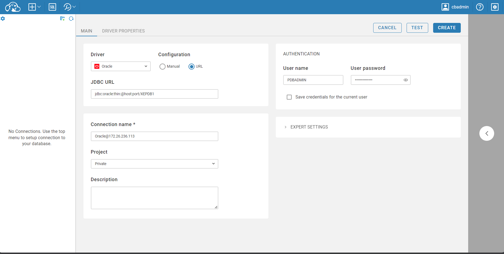

# learning-oracledb

Oracle DBをDockerで構築し、CSVデータをインサートする。

# 参考

[Oracle Database XE Release 21c (21.3.0.0) Docker Image Documentation](https://container-registry.oracle.com/ords/ocr/ba/database/express)

# Quick Start

```bash
git clone https://github.com/v1tam1nb2/learning-oracledb.git
cd learning-oracledb
chmod -R 777 oracle/
docker-compose up -d
```

# 利用するデータ

ChatGPTで生成したサンプルデータです。

```csv
name,address,mobile
John Doe,123 Elm St,555-1234
Jane Smith,456 Oak St,555-5678
Alice Johnson,789 Pine St,555-8765
Bob Brown,135 Maple St,555-4321
Carol White,246 Birch St,555-6789
・・・
```

# DBセットアップ後に実行されるスクリプト

## 01_init.sql

デーブル等を作成します。

```sql
-- PDB切り替え
ALTER SESSION SET CONTAINER=XEPDB1;

-- PDBADMIN ユーザーにRESOURCE権限を付与
GRANT RESOURCE TO PDBADMIN;

-- PDBADMIN ユーザーにUSERS表領域への書き込み権限を付与
ALTER USER PDBADMIN QUOTA UNLIMITED ON USERS;

-- TABLE作成
CREATE TABLE PDBADMIN.PERSONAL (
  name VARCHAR2(64 CHAR),
  address VARCHAR2(100 CHAR),
  mobile VARCHAR2(15 CHAR)
)
TABLESPACE USERS
;
```

## 02_insert_csv.sh

サンプルcsvをインサートするスクリプトです。

```bash
#!/bin/bash

sqlldr pdbadmin/${ORACLE_PWD}@//localhost:1521/XEPDB1 /opt/oracle/scripts/setup/import.ctl
```

`import.ctl`は以下の通りです。

```ctl
--参考：https://software.fujitsu.com/jp/manual/manualfiles/M060043/B1FN5201/01Z200/gen03/gen00041.html

OPTIONS(SKIP=1) --CSVデータの見出しをスキップするため、SKIP=1は必須
LOAD DATA
INFILE '/data/personal_data.csv' ----読み込むファイル
INSERT
INTO TABLE PDBADMIN.PERSONAL --対象のテーブル名
FIELDS TERMINATED BY ',' --データを「,」で区切る
OPTIONALLY ENCLOSED BY '"' --「"」で囲む
TRAILING NULLCOLS --データの存在しないものはNULLとして扱う
(
name,
address,
mobile
)
```

# 接続確認等


## ログイン

```bash
docker exec -it oracle sqlplus pdbadmin/OraclePassw0rd@XEPDB1
```

## 接続しているコンテナ名を取得

```sql
show con_name;
```

```

CON_NAME
------------------------------
XEPDB1
```

以下のように接続先情報を表示することもできる。（参考：[Oracle Database に関係するいろいろなコマンドまとめ](https://qiita.com/sugimount/items/4d4f8ccee095353f51ec)）

```sql
 select
   'DB Name: '  ||Sys_Context('Userenv', 'DB_Name')||
   ' / CDB?: '     ||case
     when Sys_Context('Userenv', 'CDB_Name') is not null then 'YES'
       else  'NO'
       end||
   ' / Auth-ID: '   ||Sys_Context('Userenv', 'Authenticated_Identity')||
   ' / Sessn-User: '||Sys_Context('Userenv', 'Session_User')||
   ' / Container: ' ||Nvl(Sys_Context('Userenv', 'Con_Name'), 'n/a')
   "Who am I?"
   from Dual
   /
```

```
Who am I?
--------------------------------------------------------------------------------
DB Name: XEPDB1 / CDB?: YES / Auth-ID: PDBADMIN / Sessn-User: PDBADMIN / Container: XEPDB1
```

## ログインしているユーザーが OWNER のテーブルを表示

```sql
select table_name from USER_TABLES;
```

```
TABLE_NAME
--------------------------------------------------------------------------------
PERSONAL
```

## データ確認

```sql
select * from PERSONAL;
```

# PDBローカル管理者ユーザーの権限を確認する

参考：[PDBにローカルユーザーを作成する（Oracle Database 19c）](https://t0k0sh1.com/create-local-user-oracle19c-pdb)

## SQL*Plusを起動

```bash
docker exec -it oracle sqlplus / as sysdba
```

##  CDBに接続出来ていることを確認

```sql
show con_name;
```

```
CON_NAME
------------------------------
CDB$ROOT
```

## PDBの確認

```sql
show pdbs;
```

```
    CON_ID CON_NAME                       OPEN MODE  RESTRICTED
---------- ------------------------------ ---------- ----------
         2 PDB$SEED                       READ ONLY  NO
         3 XEPDB1                         READ WRITE NO
```

作成済みのPDBであるXEPDB1にローカルユーザーを作成していく。

## XEPDB1に切り替え

```sql
alter session set container=XEPDB1;
```

```
Session altered.
```

XEPDB1に切り替わったことを確認する。

```sql
show con_name;
```

```

CON_NAME
------------------------------
XEPDB1
```

## PDBローカル管理者ユーザーPDBADMINに必要な権限があるかどうか確認

- SYS.DBA_ROLE_PRIVS
  - データベース内のすべてのユーザーおよびロールに付与されたロールを示す
- SYS.DBA_SYS_PRIVS
  - ユーザーおよびロールに付与されたシステム権限を示す

```sql
SELECT GRANTEE, GRANTED_ROLE, ADMIN_OPTION
FROM SYS.DBA_ROLE_PRIVS
WHERE GRANTEE = 'PDBADMIN'
/
```

```
GRANTEE
--------------------------------------------------------------------------------
GRANTED_ROLE
--------------------------------------------------------------------------------
ADM
---
PDBADMIN
PDB_DBA
YES

PDBADMIN
RESOURCE
NO

GRANTEE
--------------------------------------------------------------------------------
GRANTED_ROLE
--------------------------------------------------------------------------------
ADM
---
```

`SYS.DBA_SYS_PRIVS`も確認。特に権限は付与されていない。

```sql
SELECT GRANTEE, PRIVILEGE, ADMIN_OPTION FROM SYS.DBA_SYS_PRIVS WHERE GRANTEE = 'PDBADMIN';
```

```

no rows selected

```

`PDBADMIN`に与えられていた`PDB_DBA`ロールを確認する。

`SYS.DBA_ROLE_PRIVS`を確認する。

```sql
SELECT GRANTEE, GRANTED_ROLE, ADMIN_OPTION FROM SYS.DBA_ROLE_PRIVS WHERE GRANTEE = 'PDB_DBA';
```

```

GRANTEE
--------------------------------------------------------------------------------
GRANTED_ROLE
--------------------------------------------------------------------------------
ADM
---
PDB_DBA
CONNECT
NO


```

CONNECTロールが付与されているだけ。

`SYS.DBA_SYS_PRIVS`を確認する。

```sql
SELECT GRANTEE, PRIVILEGE, ADMIN_OPTION FROM SYS.DBA_SYS_PRIVS WHERE GRANTEE = 'PDB_DBA';
```

```

GRANTEE PRIVILEGE                                ADM
------- ---------------------------------------- ---
PDB_DBA CREATE PLUGGABLE DATABASE                NO
PDB_DBA CREATE SESSION                           NO

```

`CREATE PLUGGABLE DATABASE`、`CREATE SESSION`が付与されているだけで、DBA関連の権限は付与されていないことが分かる。

## PDB_DBAロールにDBAロールを付与する

>PDBローカル管理者ユーザーでローカルユーザーを作成できるようにするために、PDBローカル管理者ユーザーに付与されていた`PDB_DBA`ロールに`DBA`ロールを付与することにします。

```sql
GRANT DBA TO PDB_DBA;
```

```

Grant succeeded.

```

`PDB_DBA`ロールに`DBA`ロールが付与されているはずなので確認する。

```sql
SELECT GRANTEE, GRANTED_ROLE, ADMIN_OPTION FROM SYS.DBA_ROLE_PRIVS WHERE GRANTEE = 'PDB_DBA';
```

```

GRANTEE
--------------------------------------------------------------------------------
GRANTED_ROLE
--------------------------------------------------------------------------------
ADM
---
PDB_DBA
DBA
NO

PDB_DBA
CONNECT
NO

GRANTEE
--------------------------------------------------------------------------------
GRANTED_ROLE
--------------------------------------------------------------------------------
ADM
---


```

もともと付与されていた`CONNECT`ロールに加え、`DBA`ロールが付与されていることを確認できた。

これで`PDB`ローカル管理者ユーザー`PDBADMIN`でローカルユーザーの作成ができるようになったので、一度ログアウトする。

```
exit
```

# ローカルユーザーを作成する

`PDBADMIN`ユーザーで`XEPDB1`へログインします。

```bash
docker exec -it oracle sqlplus pdbadmin/OraclePassw0rd@XEPDB1
```

ローカルユーザーに割り当てるテーブルスペースを作成するべきかどうかを判断するために、テーブルスペースを確認する。

```sql
SELECT TABLESPACE_NAME, BLOCK_SIZE, INITIAL_EXTENT, MAX_EXTENTS, MAX_SIZE, STATUS, CONTENTS FROM SYS.DBA_TABLESPACES;

```

```

TABLESPACE_NAME                BLOCK_SIZE INITIAL_EXTENT MAX_EXTENTS   MAX_SIZE
------------------------------ ---------- -------------- ----------- ----------
STATUS    CONTENTS
--------- ---------------------
SYSTEM                               8192          65536  2147483645 2147483645
ONLINE    PERMANENT

SYSAUX                               8192          65536  2147483645 2147483645
ONLINE    PERMANENT

UNDOTBS1                             8192          65536  2147483645 2147483645
ONLINE    UNDO


TABLESPACE_NAME                BLOCK_SIZE INITIAL_EXTENT MAX_EXTENTS   MAX_SIZE
------------------------------ ---------- -------------- ----------- ----------
STATUS    CONTENTS
--------- ---------------------
TEMP                                 8192        1048576             2147483645
ONLINE    TEMPORARY

USERS                                8192          65536  2147483645 2147483645
ONLINE    PERMANENT


```

```sql
SELECT FILE_NAME, TABLESPACE_NAME, BYTES, BLOCKS, STATUS FROM SYS.DBA_DATA_FILES;
```

```

FILE_NAME
--------------------------------------------------------------------------------
TABLESPACE_NAME                     BYTES     BLOCKS STATUS
------------------------------ ---------- ---------- ---------
/opt/oracle/oradata/XE/XEPDB1/system01.dbf
SYSTEM                          293601280      35840 AVAILABLE

/opt/oracle/oradata/XE/XEPDB1/sysaux01.dbf
SYSAUX                          377487360      46080 AVAILABLE

/opt/oracle/oradata/XE/XEPDB1/undotbs01.dbf
UNDOTBS1                        104857600      12800 AVAILABLE


FILE_NAME
--------------------------------------------------------------------------------
TABLESPACE_NAME                     BYTES     BLOCKS STATUS
------------------------------ ---------- ---------- ---------
/opt/oracle/oradata/XE/XEPDB1/users01.dbf
USERS                             5242880        640 AVAILABLE


```

デフォルトに使用したい`USERS`テーブルスペース、テンポラリに使用したい`TEMP`テーブルスペースがすでに存在しているため、テーブルスペースは作成せず進める。

ローカルユーザー`user01`を作成します。テーブルスペースは先ほど確認した`USERS`テーブルスペースと`TEMP`テーブルスペースを使用する。

```sql
CREATE USER user01 IDENTIFIED BY password
DEFAULT TABLESPACE USERS
QUOTA UNLIMITED ON USERS
TEMPORARY TABLESPACE TEMP
/
```

```

User created.

```

## ローカルユーザーに権限を付与する

以下の3つを付与する。

- RESOURCEロール
  - テーブル等のオブジェクト作成を可能にするロール
- CREATE SESSION権限
  - データベースに接続するために必要な権限
- UNLIMITED TABLESPACE権限
  - テーブルスペースを制限なしで使用できる権限


```sql
GRANT RESOURCE TO user01;
GRANT CREATE SESSION TO user01;
GRANT UNLIMITED TABLESPACE TO user01;
```

```
SQL> GRANT RESOURCE TO user01;

Grant succeeded.

SQL> GRANT CREATE SESSION TO user01;

Grant succeeded.

SQL> GRANT UNLIMITED TABLESPACE TO user01;

Grant succeeded.

SQL>
```

ロール、権限が付与されているか確認する。

```sql
SELECT GRANTEE, GRANTED_ROLE, ADMIN_OPTION FROM SYS.DBA_ROLE_PRIVS WHERE GRANTEE = 'USER01';
SELECT GRANTEE, PRIVILEGE, ADMIN_OPTION FROM SYS.DBA_SYS_PRIVS WHERE GRANTEE = 'USER01';
```

```
SQL> SELECT GRANTEE, GRANTED_ROLE, ADMIN_OPTION FROM SYS.DBA_ROLE_PRIVS WHERE GRANTEE = 'USER01';

GRANTEE
--------------------------------------------------------------------------------
GRANTED_ROLE
--------------------------------------------------------------------------------
ADM
---
USER01
RESOURCE
NO


SQL> SELECT GRANTEE, PRIVILEGE, ADMIN_OPTION FROM SYS.DBA_SYS_PRIVS WHERE GRANTEE = 'USER01';

GRANTE PRIVILEGE                                ADM
------ ---------------------------------------- ---
USER01 UNLIMITED TABLESPACE                     NO
USER01 CREATE SESSION                           NO

SQL>
```

一旦ここで`exit`する。

# 作成したユーザーの動作確認

`user01`でログインする。

```bash
docker exec -it oracle sqlplus user01/password@XEPDB1
```

## テーブル作成・追加・検索

```
CREATE TABLE emp
(
  empno   VARCHAR2(10) NOT NULL,
  empname VARCHAR2(50),
  gender  NUMBER(1, 0)
)
/
INSERT INTO emp VALUES ('ABC', 'DEF', '1');
SELECT * FROM emp;
```

```
SQL> CREATE TABLE emp
(
  empno   VARCHAR2(10) NOT NULL  2    3  ,
  empname VARCHAR2(50),
  gender  NUMBER(1, 0)
)  4    5    6
  7
SQL> CREATE TABLE emp
(
  empno   VARCHAR2(10) NOT NULL  2    3  ,
  empname VARCHAR2(50),
  gender  NUMBER(1, 0)
)  4    5    6
/  7

Table created.

SQL> INSERT INTO emp VALUES ('ABC', 'DEF', '1');

1 row created.

SQL> SELECT * FROM emp;

EMPNO      EMPNAME                                                GENDER
---------- -------------------------------------------------- ----------
ABC        DEF                                                         1

SQL>
```

## テーブルの削除

```sql
DROP TABLE emp;
```

```

Table dropped.

```

# CloudbeaverからOracleDBへ接続

JDBC URL

```
jdbc:oracle:thin:@host:port/XEPDB1
```


